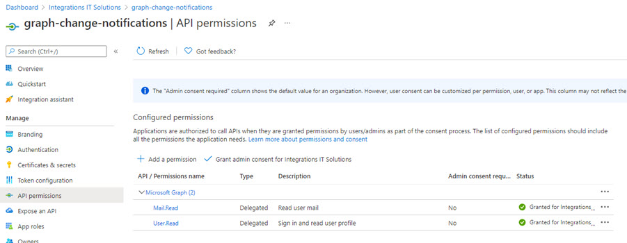
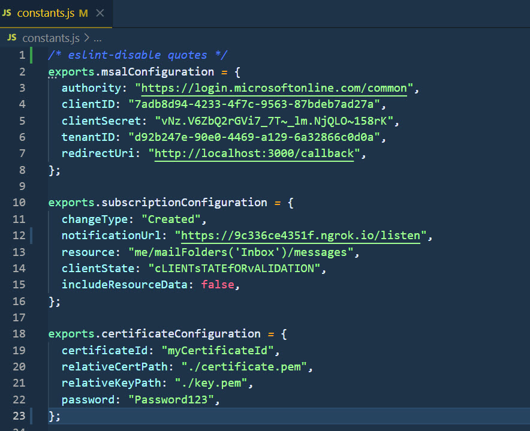

## Change Notifications

[Set up notifications for changes in user data](https://docs.microsoft.com/en-us/graph/webhooks)

[Using Azure Event Hubs to receive change notifications](https://docs.microsoft.com/en-us/graph/change-notifications-delivery)

Using the Microsoft Graph API, an app can subscribe to changes on the following resources:

-   Cloud printing printer
-   Cloud printing printTaskDefinition
-   Content within the hierarchy of any folder driveItem on a user's personal OneDrive
-   Content within the hierarchy of the root folder driveItem on OneDrive for Business
-   Group
-   Microsoft 365 group conversation
-   Outlook event
-   Outlook message
-   Outlook personal contact
-   Security alert
-   SharePoint list
-   Teams callRecord
-   Teams chatMessage
-   Teams presence (preview)
-   TodoTask (preview)
-   User

## Demo

Change Notifications node.js:

```json
POST https://graph.microsoft.com/v1.0/subscriptions
Content-Type: application/json
{
  "changeType": "created,updated",
  "notificationUrl": "https://webhook.azurewebsites.net/notificationClient",
  "resource": "/me/mailfolders('inbox')/messages",
  "expirationDateTime": "2016-03-20T11:00:00.0000000Z",
  "clientState": "SecretClientState"
}
```

App Registration:



Use Ngrok to provide an adressable endpoint. Use Endpoint in constants.js:

```
ngrok http 3000 -host-header=rewrite
```


Update Config in `constants.js`:



Start app in another terminal

```
npm run start
```

Note: Sample taken from [here](https://github.com/microsoftgraph/nodejs-webhooks-rest-sample). A .Net version is available [here](https://github.com/microsoftgraph/msgraph-training-changenotifications/tree/master/demos/03-track-changes)


## Additional Labs

[Use Change Notifications and Track Changes with Microsoft Graph](https://docs.microsoft.com/en-us/learn/modules/msgraph-changenotifications-trackchanges/)