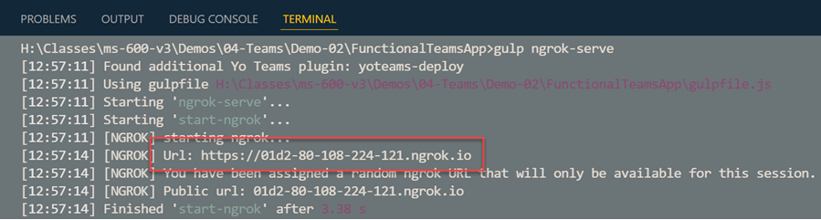
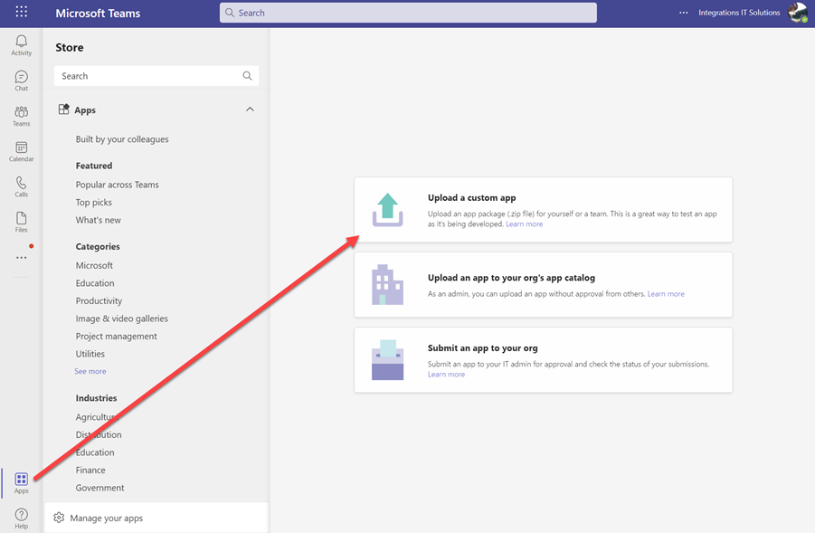
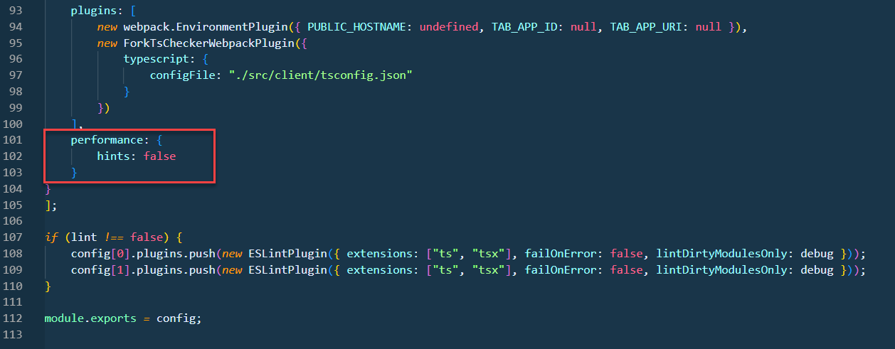

# Getting Started

[Get started with Microsoft Teams app development](https://docs.microsoft.com/en-us/microsoftteams/platform/build-your-first-app/build-first-app-overview#get-prerequisites)

[Build apps with the Teams Toolkit and Visual Studio Code](https://docs.microsoft.com/en-us/microsoftteams/platform/toolkit/visual-studio-code-overview)

## Basic Teams Workflow

Typcially Teams development is done using the web version of teams at [http://teams.microsoft.com](http://teams.microsoft.com) because it allows easy browser Dev Tools debugging.

Three scaffolding options:

-   `generator-teams@2.17.1` creates a class based structure that corresponds to the lab guides.
-   The current generator (V3.x) creates a [React Hooks](https://reactjs.org/docs/hooks-intro.html) based structure.
-   [Teams Toolkit](https://docs.microsoft.com/en-us/microsoftteams/platform/toolkit/teams-toolkit-fundamentals) also creates a different structure

Scaffolding:

```
yo teams
```

Interpolates env to manifest & create `./package/*.zip`:

```
gulp manifest
```

Build the project and create the `./dist/*` folder:

```
gulp build
```

Serve the project

```
gulp serve
```

Establish a secure tunnel to test:

```
gulp ngrok-serve
```



>Note: Update `PUBLIC_HOSTNAME` in `.env` to use your current ngrok tunnel after restart. If you use ngkrok for the first time use `ngrok authtoken 3XjdFZdf4PgB2898gcdbu_...` to set your ngrok auth token.

To upload your app go to [http://teams.microsoft.com](http://teams.microsoft.com):




## Ngrok

To avoid having the ngrok name changed all the time use from within a Teams project in two seperate terminals, or even better run gulp start-ngrok in a seperate standalone console window.

Replace `gulp ngrok-serve` with:

```
gulp start-ngrok (from within a Teams proj)
```

```
gulp serve --debug
```


If you want to reserve a subdomain which requires a paid account you configure ngrok to use that domain with a `ngrok.yml` file:

```
authtoken: 3XjdFZdf4PgB2898gcdbu_4Rukvv4BYxxxxxxxx
tunnels:
  http-tunnel:
    proto: http
    addr: 80
    subdomain: integrationsonline
  node-tunnel:
    proto: http
    addr: 3007
    subdomain: integrationsonline
```

## Webpack

Do avoid webpack size warning during you getting started process you can disable performance hints in `webpack.config.js` of your project by adding:

```json
performance: {
    hints: false
}
```



## ESlint

To disable ESlint add the following line to your settings of VS Code:

```
"eslint.enable": false
```

## Labs

[01-Tabs, Exercise 1: 01-Exercise-Create a custom Microsoft Teams personal tab](../../../Labs/4-Teams/01-Tabs/01-Exercise-Create%20a%20custom%20Microsoft%20Teams%20personal%20tab.md)
