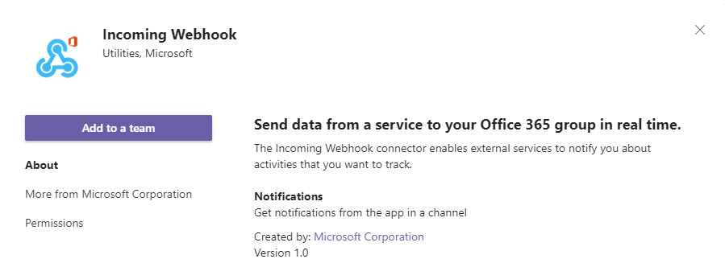
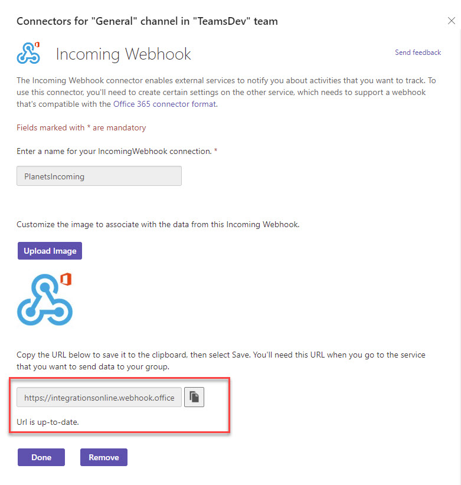
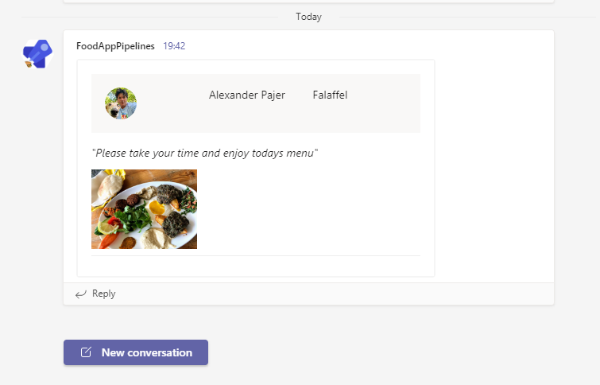

# Incoming Webhook - no Teams code needed

-   Register Incoming Webhook using `Add Tab`:

    

    

- Copy the Webhook Url and save it to `./adaptive-cards/webhookuri.txt`: 

    ```powershell
    https://integrationsonline.webhook.office.com/webhookb2/552611f2-3437-4290-98ae-1c8dca98b9cf@d92b247e-90e0-4469-a129-6a32866c0d0a/IncomingWebhook/adba3096e6fe404ca88d9bfcfce2efac/25853297-1418-4fc4-96ec-22f8bc83a64b
    ```
-   Execute `test-card.ps1`:

    ```powershell
    $json = Get-Content -Path .\card.json
    $uri =  Get-Content -Path .\webhookuri.txt

    Invoke-RestMethod -Method post -ContentType 'Application/Json' -Body $json -Uri $uri
    ```

-  Find in Teams:

    