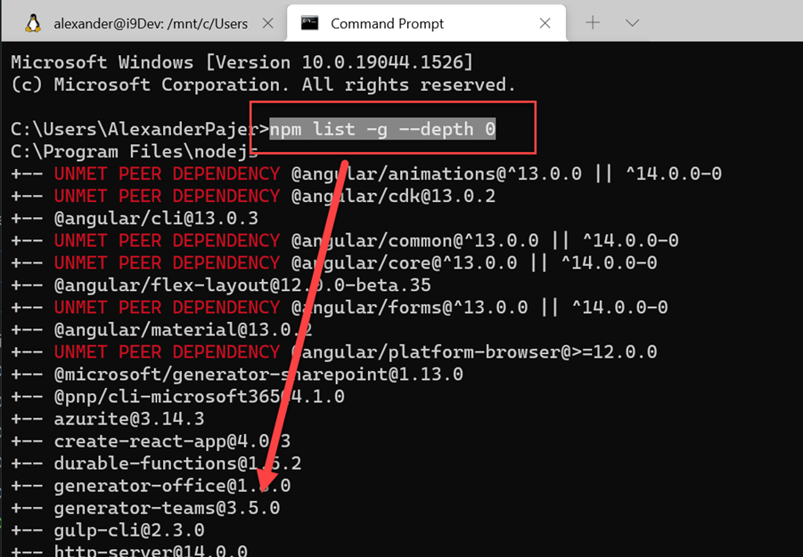
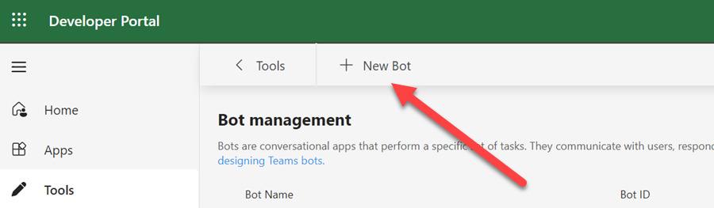
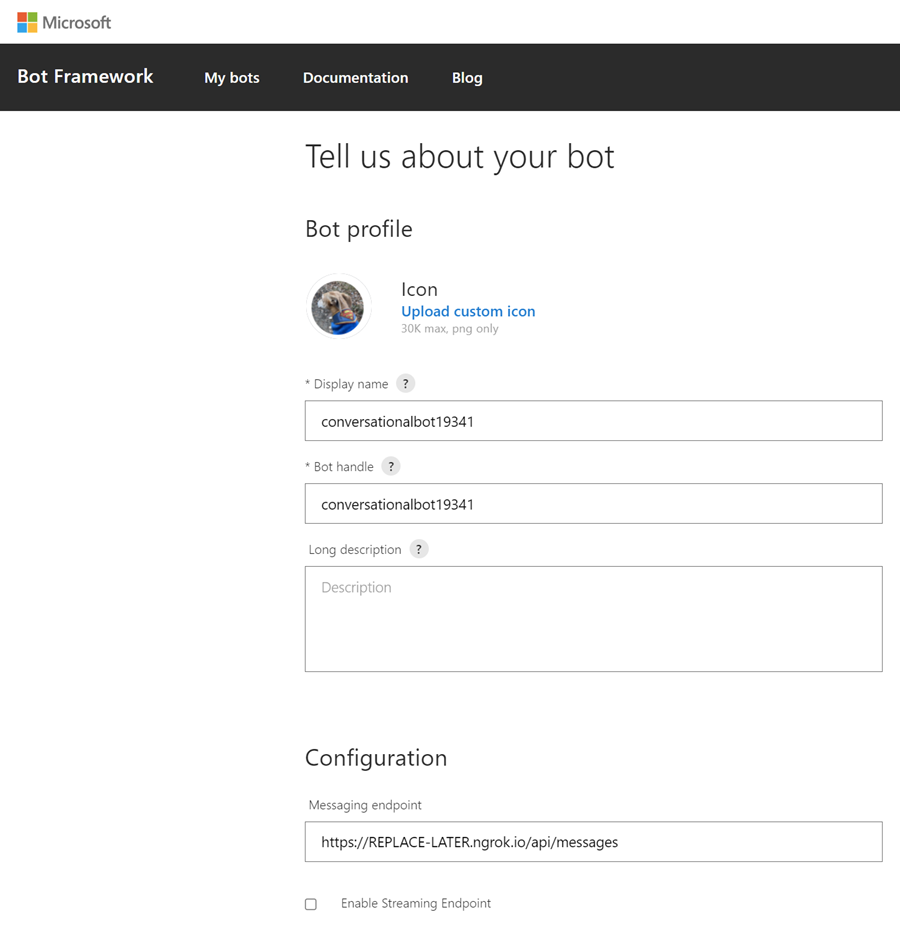
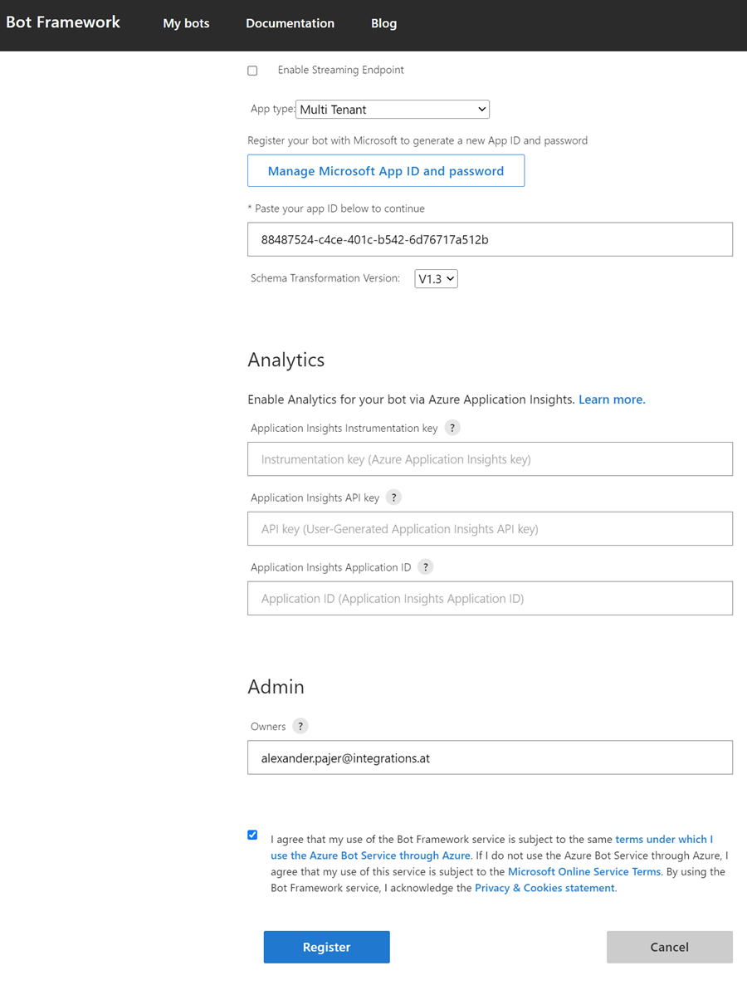
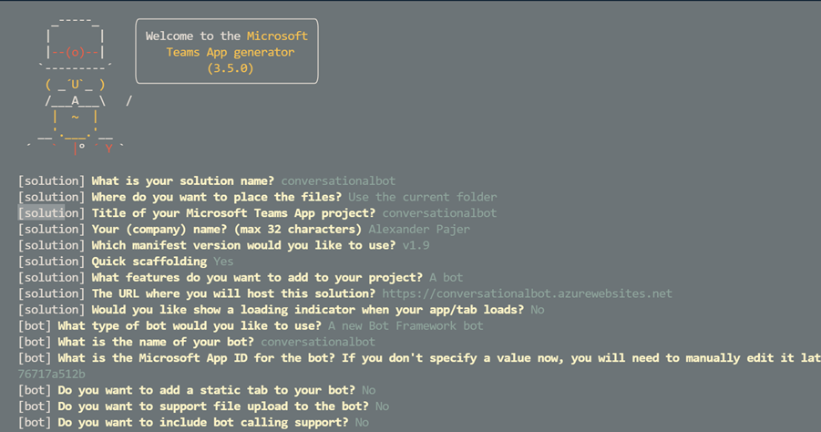
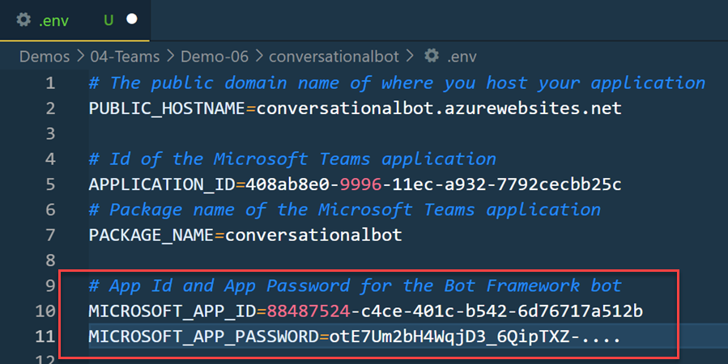
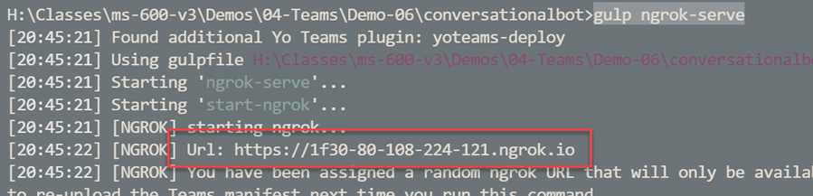
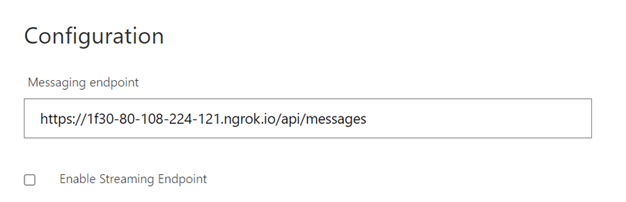

# Conversational Bots

[Bots in Microsoft Teams](https://docs.microsoft.com/en-us/microsoftteams/platform/bots/what-are-bots)

[Teams Activity Handler](https://docs.microsoft.com/en-us/microsoftteams/platform/bots/bot-basics?tabs=csharp)

[Bot Framework Composer](https://docs.microsoft.com/en-us/composer/introduction)

[Bot Framework Emulator](https://github.com/Microsoft/BotFramework-Emulator/releases)

[Power Virtual Agents](https://docs.microsoft.com/en-us/power-virtual-agents/fundamentals-what-is-power-virtual-agents)

## Updated guide for Bot Registration in subsequent modules and Labs

Make sure you have the latest production release of the yo team generator installed and use v11 for scaffolding



### App Registration

Create an App Registration to provide a service principal that can be used with the bot by executing:

```bash
rnd=$RANDOM
app=conversationalbot$rnd

id=$(az ad app create --display-name $app --query appId -o tsv)
secret=$(az ad app credential reset --id $id --append --query password -o tsv)

echo "Use id in your bot registration: " $id
echo "Use secret in your bot registration: " $secret
```

### Complete Bot Registration

Navigate to [Microsoft 365 Teams Developer Portal / Tools / Bot Management - https://dev.teams.microsoft.com/bots](https://dev.teams.microsoft.com/bots) and create a new bot:



Click on your new bot and notice the metadata on the Configure blade


Navigate to [Bot Framework Registration](https://dev.botframework.com/bots), select your bot and update the metadata:





### Scaffold and test bot project using yeoman teams generator

```cmd
md FOLDER
cd FOLDER
yo teams
```



Update `.env` with the `secret` from the app reg that you have created:



Execute `gulp ngrok-serve` and note the `ngrok url`:



Update the endpoint:



## Labs

[04-Bots, 01-Exercise-Creating conversational bots](../../../Labs/4-Teams/04-Bots/01-Exercise-Creating%20conversational%20bots.md)