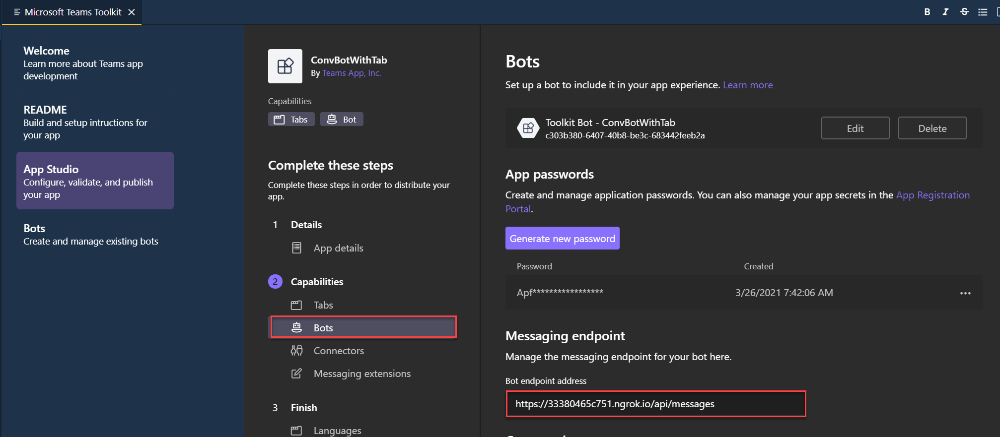

# Bots

[Bots in Microsoft Teams](https://docs.microsoft.com/en-us/microsoftteams/platform/bots/what-are-bots)

[Bot Framework Composer](https://docs.microsoft.com/en-us/composer/introduction)

[Bot Framework Emulator](https://github.com/Microsoft/BotFramework-Emulator/releases)

[Power Virtual Agents](https://docs.microsoft.com/en-us/power-virtual-agents/fundamentals-what-is-power-virtual-agents)

## Labs

[Exercise 7: Creating a Bot in Microsoft Teams](../../../Labs/Lab04/Lab04-Extending-Teams-lab-instructions/08-Exercise-7-Creating-a-bot-in-Microsoft-Teams.md)

## Conversational Bot Demo

-   Scaffold using Teams Toolkit
-   Start: `ngrok http -host-header=rewrite 3978`
-   Register Url in Teams Toolkit as Messaging endpoint, ie: https://384b6183b176.ngrok.io/api/messages

    

-   Run App

    ```
    npm install
    npm start
    ```

-   Sideload Extension using `F5` and `Add`
