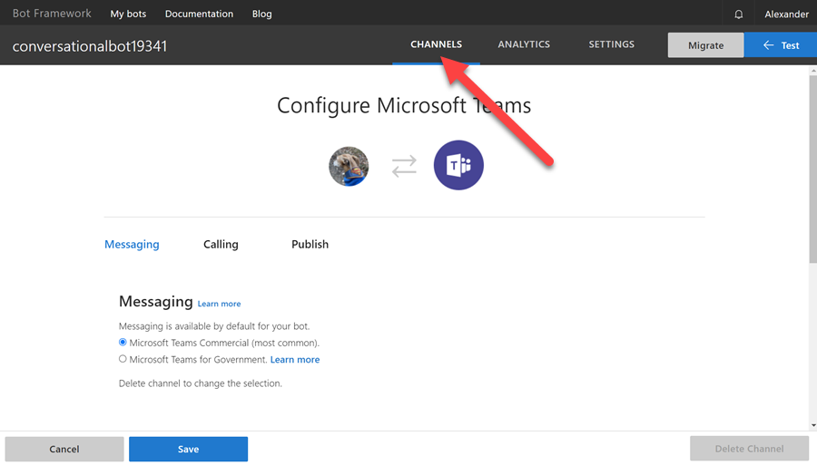

# Conversational Bots

[Bots in Microsoft Teams](https://docs.microsoft.com/en-us/microsoftteams/platform/bots/what-are-bots)

[Teams Activity Handler](https://docs.microsoft.com/en-us/microsoftteams/platform/bots/bot-basics?tabs=csharp)

[Bot Framework Composer](https://docs.microsoft.com/en-us/composer/introduction)

[Bot Framework Emulator](https://github.com/Microsoft/BotFramework-Emulator/releases)

[Power Virtual Agents](https://docs.microsoft.com/en-us/power-virtual-agents/fundamentals-what-is-power-virtual-agents)

## Updated guide for Bot Registration in subsequent Modules and Labs

### Create Bot Registration

Navigate to [Microsoft 365 Teams Developer Portal / Tools / Bot Management - https://dev.teams.microsoft.com/bots](https://dev.teams.microsoft.com/bots) and create a new bot:


Click on your new bot and notice the metadata on the Configure blade


Navigate to [Bot Framework Registration](https://dev.botframework.com/bots) and select your bot

Check if Teams Channel is enabled:



Complete the bot metadata using the `Settings`:


### Scaffold and test bot project using yeoman teams generator

>Note: Make sure you have the latest production release of the yo team generator installed.


```cmd
md FOLDER
cd FOLDER
yo teams
```


Update `.env` with the `secret` from the app reg that you have created:


Execute `gulp ngrok-serve` and note the `ngrok url`:


Update the endpoint using the ngrok url and `/api/messages`:


## Labs

[01-Bots](../../../Labs/4-Develop%20apps%20for%20Microsoft%20Teams%2F04-Create%20interactive%20conversational%20bots%2F/)
