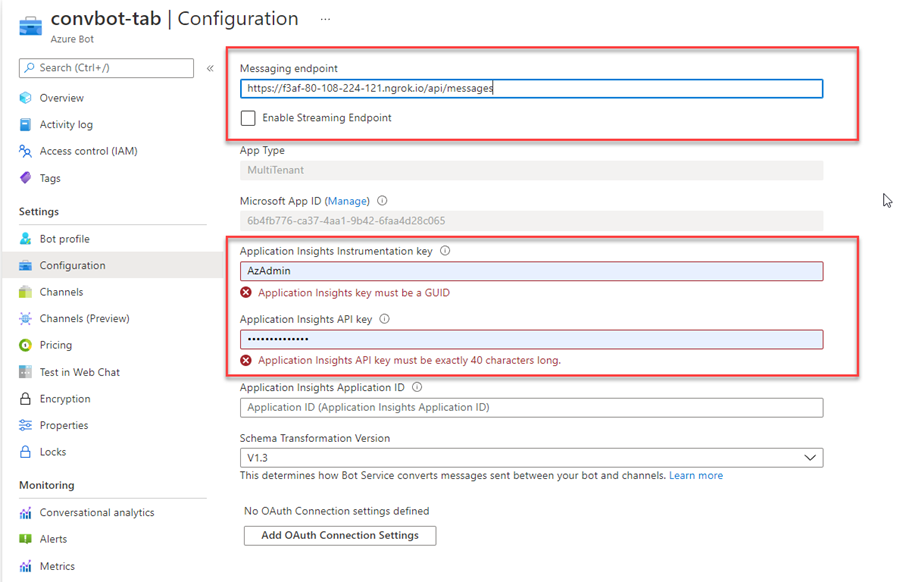

# Bots

[Bots in Microsoft Teams](https://docs.microsoft.com/en-us/microsoftteams/platform/bots/what-are-bots)

[Teams Activity Handler](https://docs.microsoft.com/en-us/microsoftteams/platform/bots/bot-basics?tabs=csharp)

[Bot Framework Composer](https://docs.microsoft.com/en-us/composer/introduction)

[Bot Framework Emulator](https://github.com/Microsoft/BotFramework-Emulator/releases)

[Power Virtual Agents](https://docs.microsoft.com/en-us/power-virtual-agents/fundamentals-what-is-power-virtual-agents)

## Demos

### Conversational Bot using Yeoman

When completing all Bot related samples, you will be asked to update the messaging endpoint with your ngrok url + `api/messages`. As Microsoft was not able or willing to fix this issue for at least 2 years now please update the messaging endpoint using the script `update-endpoint.azcli` and your own values. 

```bash
loc=westeurope
grp=ms600-m04-convbot
bot=convbot-tab

ngrok=https://f3af-80-108-224-121.ngrok.io

az bot update -n $bot -g $grp --endpoint $ngrok/api/messages
```



### Conversational Bot using Toolkit

-   Scaffold using Teams Toolkit
-   Start: `ngrok http -host-header=rewrite 3978`
-   Register Url in Teams Toolkit as Messaging endpoint, ie: https://384b6183b176.ngrok.io/api/messages

    

-   Run App

    ```
    npm install
    npm start
    ```

-   Sideload Extension using `F5` and `Add`

## Labs

[04-Bots, 01-Exercise-Creating conversational bots](../../../Labs/4-Teams/04-Bots/01-Exercise-Creating%20conversational%20bots.md)
