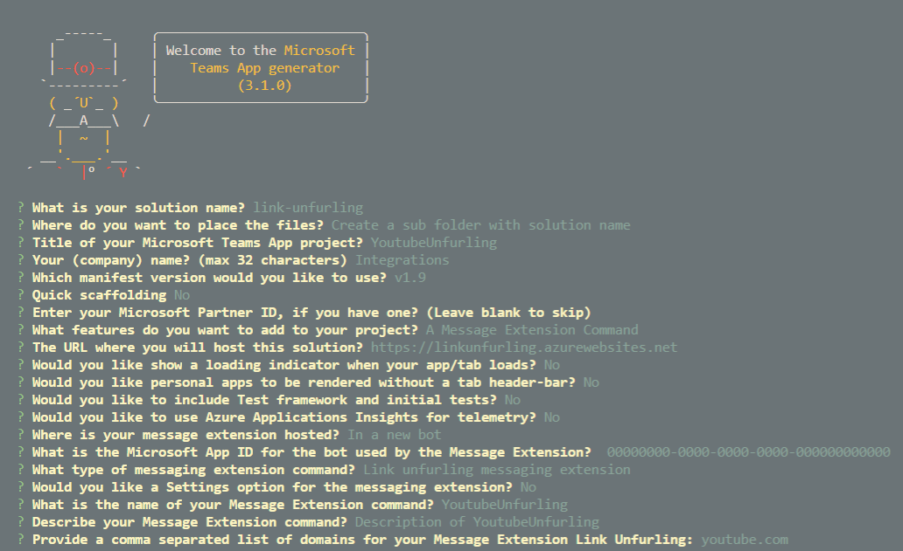

# Link unfurling

[Link unfurling](https://docs.microsoft.com/en-us/microsoftteams/platform/messaging-extensions/how-to/link-unfurling?tabs=javascript)

## Demo

Options for scaffolding:



Check `manifest.json` after scaffolding:

```json
"composeExtensions": [
    {
      "botId": "{{MICROSOFT_APP_ID}}",
      "canUpdateConfiguration": false,
      "commands": [],
      "messageHandlers": [
        {
          "type": "link",
          "value": {
            "domains": [
              "*.youtube.com"
```

## Labs

[05-MsgExt, 03-Exercise-Implement link unfurling messaging extensions](../../../Labs/4-Teams/05-MsgExt/03-Exercise-Implement%20link%20unfurling%20messaging%20extensions.md)
